# AI Oversight Orchestrator (Skeleton)

Modular, deterministic oversight framework for multi-agent swarms: intent routing, behavioral ownership tracking, safety gates, auditable DAG trails.

## Architecture

```mermaid
flowchart LR
  Ingress[IngressNormalizer] --> Context[ContextPackManager]
  Context --> Signals[ControlSignalAggregator]
  Signals --> Intent[IntentRouter]
  Intent --> HumanFactors[HumanFactorsEngine]
  HumanFactors --> Sentiment[SentimentApprovalDisambiguator]
  Sentiment --> Safety[SafetyRegulationModule]
  Safety --> Policy[PolicyGatekeeper]
  Policy --> Retrieval[RetrievalVerificationLayer]
  Retrieval --> GenEdit[GeneratorEditorSplit]
  GenEdit --> Tool[ToolOrchestrator]
  Tool --> Determinism[DeterminismHarness]
  Determinism --> Telemetry[TelemetryAuditTrail]
```

Pipeline: ingress → context pack → control signals → intent router → human factors → sentiment/approval disambiguation → safety regulation → policy gatekeeper → retrieval verification → generator/editor split → tool orchestrator → determinism harness → telemetry/audit.

## Key concepts

- **Behavioral vs declared ownership:** Declared ownership is what the system assigns (e.g. task → agent). Behavioral ownership reflects who actually does the work across a chain; it can drift from declared ownership and needs to be tracked for accountability and handoff.
- **Psyop risk signals:** Indicators that content or behavior may be manipulative or information-operations–style; the framework allows pluggable signal aggregation for safety gates without specifying implementation.
- **Relational ownership emergence:** Ownership can emerge from interaction patterns (who responds to whom, who corrects whom) rather than from static assignment alone.
- **Immutable audit trails:** Cycle state, access, and control decisions are logged in append-only, tamper-evident form for replay and accountability.
- **Gate-before-action:** Policy and safety gates run before executing actions; denied actions are audited rather than executed.

## Status

Research prototype / skeleton. Not production-ready. Built independently Jan–Feb 2026.

## Provenance

This framework was built in isolation as a first-principles design for multi-agent oversight. It parallels emerging 2026 work on agent protocols, sovereignty illusions, and probabilistic oversight rubrics, but is not derived from any single external implementation.

## Get in touch

DM [@andrew867](https://x.com/andrew867) on X or connect on LinkedIn for discussions, collabs, or demo access.
