# Pipeline architecture

Canonical source for the oversight pipeline flowchart. Forks can edit this file to update the diagram; the same diagram is embedded in the main [README](../README.md).

```mermaid
flowchart LR
  Ingress[IngressNormalizer] --> Context[ContextPackManager]
  Context --> Signals[ControlSignalAggregator]
  Signals --> Intent[IntentRouter]
  Intent --> HumanFactors[HumanFactorsEngine]
  HumanFactors --> Sentiment[SentimentApprovalDisambiguator]
  Sentiment --> Safety[SafetyRegulationModule]
  Safety --> Policy[PolicyGatekeeper]
  Policy --> Retrieval[RetrievalVerificationLayer]
  Retrieval --> GenEdit[GeneratorEditorSplit]
  GenEdit --> Tool[ToolOrchestrator]
  Tool --> Determinism[DeterminismHarness]
  Determinism --> Telemetry[TelemetryAuditTrail]
```

Pipeline order: ingress → context pack → control signals → intent router → human factors → sentiment/approval disambiguation → safety regulation → policy gatekeeper → retrieval verification → generator/editor split → tool orchestrator → determinism harness → telemetry/audit.
